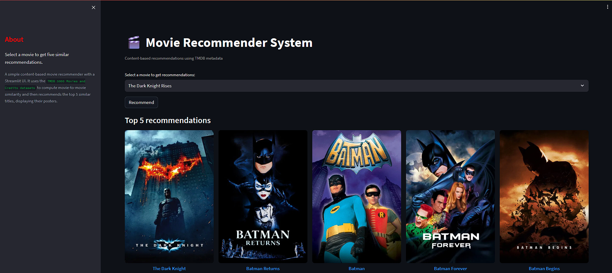

# Movie Recommender



A simple content-based movie recommender with a Streamlit UI, using the TMDB 5000 Movies and Credits datasets to compute movie-to-movie similarity. It recommends the top 5 similar titles, displaying their posters and providing a direct link to the official TMDB movie page.

The data is differentiated using vectorization method in which the user provided movie is matched with most similar movies and the 5 similar movies is displayed along with it in streamlit website


## Project structure

- `app.py`: Streamlit app (main Front-End) that loads precomputed artifacts and serves recommendations.
- `movie-recommender-system/main.ipynb`: Notebook that builds the artifacts (feature extraction and similarity matrix).
- `movie-recommender-system/tmdb_5000_movies.csv`, `movie-recommender-system/tmdb_5000_credits.csv`: Source datasets.
- Regenerated artifacts (not committed):
  - `movie-recommender-system/movies_dict.pkl`
  - `movie-recommender-system/similarity.pkl`
  - `movie-recommender-system/movie.pkl`

Note: The `.gitignore` is configured to exclude the regenerated artifacts.

## Requirements

- Python 3.9+
- Internet access (to fetch posters from TMDB at runtime)

Install dependencies:

```bash
pip install -r requirements.txt
```

## Regenerate the artifacts (first-time setup)

1. Start Jupyter in cmd:
   ```bash
   jupyter notebook
   ```
2. Open `movie-recommender-system/main.ipynb`.
3. Run all cells (Kernel → Restart & Run All).
   - If Jupyter in VS Code or Cursor prompts you to select a kernel: click "Select Another Kernel" → "Python Environments..." and choose any installed Python you see (e.g., base Anaconda Python, Python 3.11, Python 3.10, etc.). Then run "Run All" again.
4. The following files will be regenerated into `movie-recommender-system/`:
   - `movies_dict.pkl`
   - `similarity.pkl`
   - `movie.pkl`

These files are used by `app.py` and are intentionally ignored by Git. Do not commit them.

## Run the app

From the repository root:

```bash
streamlit run app.py
```

Then pick a movie title from the dropdown and click "Recommend" to see the top 5 similar movies and their posters.

## Important notes

- Poster fetching uses the TMDB API and requires internet access. If you plan to deploy, consider moving the API key in `app.py` to an environment variable.
- Please do not commit `main.ipynb` after executing cells. Notebook outputs and metadata change depending on your Python/kernel versions and execution environment, creating noisy diffs. If you must track it, clear outputs before committing.
